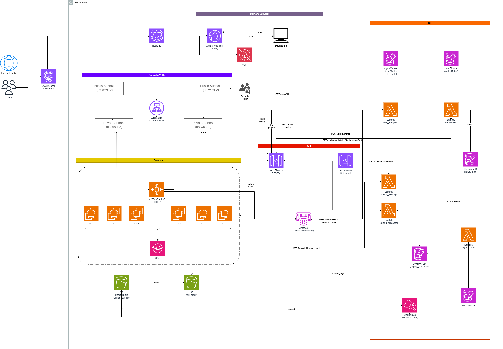
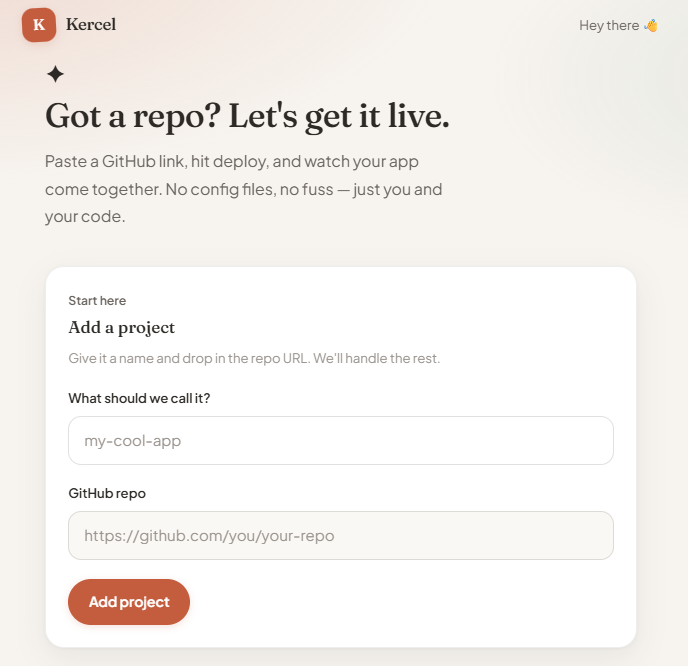

# Kercel

Kercel is an open-source alternative to Vercel that deploys static websites on AWS.

Import a GitHub repository, trigger builds on EC2 workers, and serve the build generated site through CloudFront. The infrastructure is provisioned using AWS CDK (Python), while a Python Lambda control plane manages deployments.

## Features

- GitHub repository deployments
- EC2 build workers
- CloudFront CDN for static hosting
- REST API for project and deployment management
- Real-time deployment logs over WebSockets
- IaC with AWS CDK

## Tech Stack

- Python
- AWS CDK
- AWS Lambda
- EC2
- API Gateway
- SQS
- DynamoDB
- S3
- CloudFront
- Next.js
- React

## Repository Structure

```text
.
├── infra/      # AWS CDK application and Lambda handlers
├── web/        # Next.js dashboard
└── docs/       # Documentation and images
```

## Screenshots

### Architecture



### Dashboard


## Getting Started

### Prerequisites

- Python 3.11+
- Node.js 20+
- AWS CLI configured
- AWS CDK CLI

### 1. Clone the repository

```bash
git clone https://github.com/karthiksuki/kercel.git
cd kercel
```

### 2. Deploy the infrastructure

Create a virtual environment.

**macOS / Linux**

```bash
cd infra

python3 -m venv .venv
source .venv/bin/activate
```

**Windows (PowerShell)**

```powershell
cd infra

python -m venv .venv
.venv\Scripts\Activate.ps1
```

Install dependencies and deploy.

```bash
pip install -r requirements.txt

cdk deploy --all -c stage=dev
```

After deployment, note the stack outputs:

| Output | Description |
|---------|-------------|
| `RestApiUrl` | REST API endpoint |
| `WebSocketApiUrl` | WebSocket endpoint |
| `CloudFrontDomainName` | Hosted website domain |
| `AcceleratorDns` | Global Accelerator endpoint |

> Existing `dev` stacks created with older resource names may require `cdk destroy` before redeploying.

### 3. Run the dashboard

```bash
cd ../web

cp .env.example .env.local
```

Update:

```env
NEXT_PUBLIC_API_URL=<RestApiUrl>
NEXT_PUBLIC_WS_URL=<WebSocketApiUrl>
```

Install dependencies and start the development server.

```bash
npm install
npm run dev
```

Open http://localhost:3000.

## Contributing

Contributions are welcome! Please read [CONTRIBUTING.md](CONTRIBUTING.md) before opening an issue or pull request.

## License

Licensed under the MIT License. See [LICENSE](LICENSE).